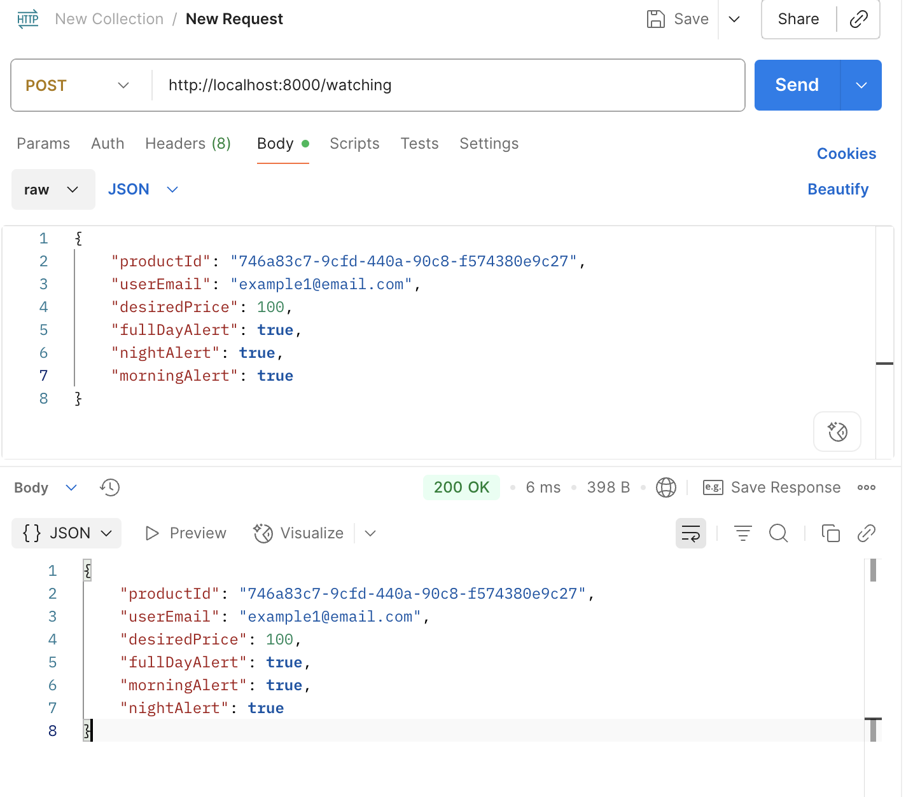
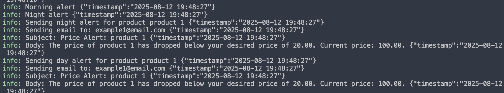

# Product-Price-Tracker

## About the product price tracker

A personal assignment to create a RESTful web service that allows users to enter a product URL and set a price drop alert

## Quick start

### Building the application

1. Install the dependencies:

```
  npm install
```

2. Build the app

```
  npm run build
```

### Running the application

There are two ways to run this applications locally

1. Run as a native express application

```
npm run dev
```

Then the application can be invoked though those RESTful endpoints: product, users, watching for alerts

#### Public facing endpoint

* `http://localhost:8000/watching`
  Method: POST

Request Body
The request body must be in JSON format and contain the following parameters:
**productId** (string): The unique identifier for the product the user wants to watch.
**userEmail** (string): The email address of the user who is setting the alert.
**desiredPrice** (number): The price at which the user wants to be notified.
**fullDayAlert** (boolean): Indicates if the user wants to receive alerts throughout the day.
**nightAlert** (boolean): Indicates if the user wants to receive alerts during the night.
**morningAlert** (boolean): Indicates if the user wants to receive alerts in the morning.

---

Example Request Body

JSON```
{
  "productId": "746a83c7-9cfd-440a-90c8-f57438...",
  "userEmail": "<example1@email.com>",
  "desiredPrice": 100,
  "fullDayAlert": true,
  "nightAlert": true,
  "morningAlert": true
}

Example Response

JSON```
{
  "productId": "",
  "userEmail": "",
  "desiredPrice": 0,
  "fullDayAlert": true,
  "morningAlert": true,
  "nightAlert": true
}

```




#### Administrative operations

* POST `http://localhost:8000/mock-alert`

This endpoint is designed to mock the actual alert services which is trigger by schedules time.
So we able to test the alert services without waiting the timer started.
It accept the Request Body

JSON```
{
  "alertType": "fullDay"
}

```

This assignment using logging as mock emails services
pretend to send alerts to users:



Response:

```

{
    "message": "Alerts sent successfully"
}

```

* `http://localhost:8000/products`
* `http://localhost:8000/users`

Those 2 API endpoints are for administrative purpose to create products and users.

## Contributions

We operate a [code of conduct](CODE_OF_CONDUCT.md) for all contributors.

See our [contributing guide](CONTRIBUTING.md) for guidance on how to contribute.

## License

Released under the [Apache 2 license](LICENCE.txt).

```

```
